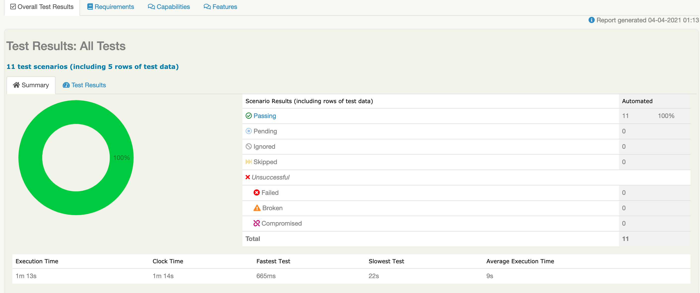

# Test Automation

## Use Maven

Open a command window and run: 

    mvn clean verify
    
This command will run all the tests
    
##Running scenarios by tags

With Cucumber framework, you need to use the cucumber.options system property for tests filtering:

    mvn clean verify -Dtags="WebFE"
 
 or 
 
    mvn clean verify -Dtags="ApiRest"

## Viewing the reports

The command provided above will produce a Serenity test report in the `target/site/serenity` directory. Go take a look!

